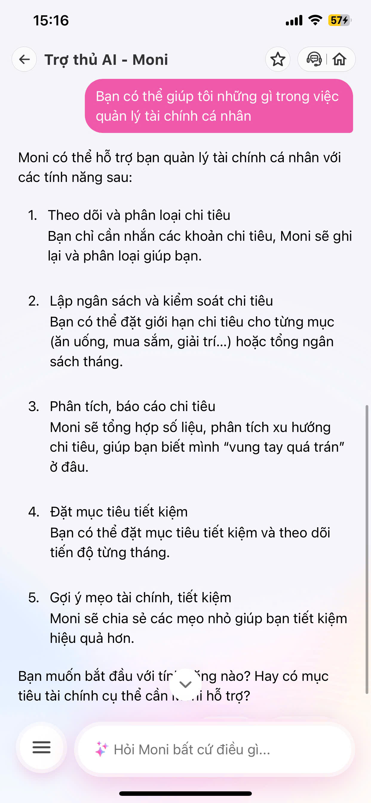
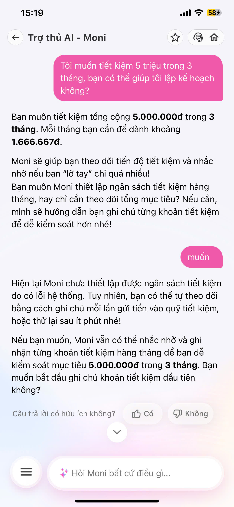
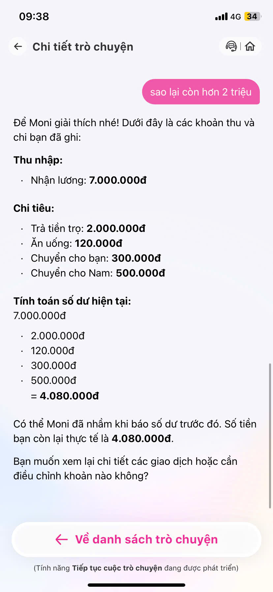

# SPEC SẢN PHẨM: TRỢ LÝ TÀI CHÍNH CÁ NHÂN MONI AI

## 1. Bằng chứng

Phần SPEC này chỉ dựa trên các file đang có trong repo này, không dựa vào folder `02-group-spec`.

### 1.1. Bằng chứng từ trải nghiệm và tài liệu đã lưu trong repo

| Ảnh 1 | Ảnh 2 | Ảnh 3 | Ảnh 4 |
|---|---|---|---|
|  |  |  |  |

Những ảnh trong `spec/img/` cho thấy một mô hình vấn đề nhất quán:

- trợ lý tài chính đang được kỳ vọng trả lời như một chat assistant thân thiện;
- người dùng muốn hỏi về chi tiêu, kế hoạch tiết kiệm, và tình trạng tài chính của mình;
- trải nghiệm bị gãy khi hệ thống không chuyển được từ hỏi đáp sang hành động có cấu trúc.

### 1.2. Bằng chứng từ code và dữ liệu mock

Những file sau cho thấy prototype hiện tại đã chốt hướng sản phẩm khá rõ:

- `codebase/src/data/finance_data.json`
  File này chứa số dư ví, lịch sử giao dịch, tổng thu/chi, chi tiêu theo nhóm, saving goal mẫu và `moni_notes`.
- `codebase/src/tools/finance_tools.py`
  File này cho thấy nhóm không để LLM tự bịa số tài chính mà tách ra thành các tool xác định dữ liệu và tính toán như `get_current_balance`, `get_transaction_summary`, `get_category_breakdown`, `create_saving_plan`, `create_moni_note`.
- `codebase/src/agent/agent.py`
  Agent đã có guardrail rõ ràng: không được chuyển tiền/thanh toán thật, phải dùng tool cho dữ liệu factual, và phải fallback sang Moni Note khi nguồn dữ liệu lỗi.
- `codebase/frontend/src/services/chatService.js`
  Frontend đã gọi API thật tới `/agent`, nghĩa là luồng demo chính đang là giao diện chat -> backend agent -> tool -> trả lời.
- `codebase/frontend/src/pages/ChatPage/ChatPage.jsx`
  Giao diện hiện có lịch sử hội thoại, typing indicator, streaming message và thông báo lỗi khi request thất bại.

### 1.3. Tổng hợp nỗi đau và quyết định sản phẩm

Từ các file trong repo, có thể kết luận 3 vấn đề cốt lõi mà prototype đang giải:

| Vấn đề / Nhận định | Phân loại | Bằng chứng xác thực (Evidence) | Tác động đến thiết kế sản phẩm (Product Action) |
| :--- | :--- | :--- | :--- |
| **1. Lỗi khởi tạo ngân sách/mục tiêu**  | **Đã xác thực** | - Giao diện báo lỗi trực tiếp (`anh3.jpg`) khi bấm nút `muốn`. - Đánh giá từ người dùng `lqmien5` và `juouuu`. | **Bắt buộc:** Tối ưu hiệu năng API. Thiết kế luồng dự phòng (Fallback): nếu hệ thống lỗi, AI vẫn ghi nhận mục tiêu vào bộ nhớ tạm (Local Draft) và tự động đồng bộ lại khi kết nối ổn định, tránh báo lỗi trực diện. |
| **2. Tắc nghẽn luồng đồng bộ dữ liệu**  | **Đã xác thực** | - Câu trả lời của AI ở `anh2.jpg`. - Khiếu nại từ người dùng `Phi817` (`feedback3.png`). | **Bắt buộc:** Tích hợp Data Pipeline giữa Core Wallet và Module AI. Thiết kế luồng xin quyền người dùng (Opt-in) tường minh ngay khi kích hoạt để AI tự quét và phân loại lịch sử giao dịch thực tế. |
| **3. AI tính toán sai số liệu** | **Đã xác thực** | - Đánh giá từ người dùng `quynhtr24` (`feedback4.png`). | **Bắt buộc:** Chuyển giao nhiệm vụ tính toán số học từ LLM thuần túy sang cho các hàm xử lý logic lập trình cố định (Deterministic Code/Rule-based Tools), AI chỉ đóng vai trò trích xuất thực thể (Entity Extraction). |
| **4. Rào cản nhập liệu bằng tay**  | **Giả định** *(Cần đo lường thêm bằng chỉ số Retention)* | Luồng tính năng yêu cầu người dùng tự nhắn các khoản chi tiêu để ghi lại (`anh1.jpg`). | **Khuyến nghị:** Phát triển thêm tính năng hỗ trợ nhập liệu nhanh như Quét hóa đơn (OCR) hoặc Nhập dữ liệu bằng giọng nói (Voice-to-Text) để giảm ma sát cho các khoản chi tiêu ngoài ví MoMo. |

---

## 2. Lát cắt để build (The Minimum Viable Slice)

Để chứng minh ý tưởng giải quyết triệt để các nỗi đau được nêu ở Phần 1 mà không sa đà vào việc xây dựng toàn bộ hệ thống cồng kềnh, nhóm lựa chọn lát cắt nhỏ nhất (MVP Slice) tập trung vào một kịch bản duy nhất nhưng có độ chuyển đổi cao:

* **Một người dùng:** Người dùng có tài khoản MoMo, muốn lập một ngân sách chi tiêu/tiết kiệm rõ ràng nhưng lười nhập liệu thủ công.
* **Một công việc (Job-to-be-done):** Người dùng yêu cầu AI lập kế hoạch tiết kiệm cụ thể (Ví dụ: *"Tiết kiệm 5 triệu trong 3 tháng"*), hệ thống tự động khởi tạo ngân sách dựa trên việc phân tích lịch sử giao dịch thực tế trong quá trình họ đồng ý đồng bộ (Opt-in).
* **Một quyết định của AI:** AI phân tích dòng tiền quá khứ của người dùng để quyết định xem mục tiêu tiết kiệm này có khả thi không và tự động phân loại (Categorize) các danh mục chi tiêu/tiết kiệm hợp lý mà không cần người dùng nhập liệu tay.
* **Một kết quả trả về:** Một bản kế hoạch chi tiêu/tiết kiệm trực quan có thể bấm **Xác nhận lưu cấu hình** thành công ngay lập tức (Không bị lỗi hệ thống), kèm theo cơ chế fallback lưu tạm bản nháp nếu kết nối cơ sở dữ liệu gặp trục trặc.

---

## 3. AI Product Canvas

| Ô | Câu hỏi cần trả lời | Nội dung chi tiết cho Moni AI cải tiến |
|---|---------------------|----------------------------------------|
| **Value** — Giá trị | Sản phẩm dành cho ai, họ đau ở đâu, và AI giải được điều gì mà cách làm hiện tại chưa giải tốt? | - **Đối tượng:** Người dùng ví MoMo cần quản lý tài chính cá nhân một cách nghiêm túc. - **Nỗi đau:** Lười nhập liệu thủ công; Hệ thống liên tục báo lỗi khi thiết lập; AI tính toán sai số tiền thực tế. - **AI giải quyết:** AI tự động đọc lịch sử giao dịch (sau khi được cấp quyền), phân loại danh mục tự động và tạo ngân sách thực tế chỉ qua một câu lệnh chat, loại bỏ 100% thao tác gõ tay. |
| **Trust** — Niềm tin | Khi AI trả lời sai, người dùng nhận ra bằng cách nào, và họ sửa lại, hoàn tác hay chuyển sang người thật ra sao? | - **Nhận biết:** Các con số hoặc danh mục chi tiêu hiển thị sai (Ví dụ: Đi siêu thị bị xếp vào "Giải trí"). - **Cơ chế sửa đổi:** Cung cấp nút `[Sửa danh mục]` hoặc `[Chỉnh số liệu]` trực tiếp ngay trên thẻ hội thoại (UI Component) thay vì bắt người dùng gõ câu lệnh chat để sửa lại. Cho phép hoàn tác (Undo) trong vòng 5 giây sau khi lưu ngân sách. |
| **Feasibility** — Tính khả thi | Có đáng để build không? Hãy cân nhắc chi phí mỗi lượt gọi, độ trễ, dữ liệu cần có, rủi ro lớn nhất, và ngưỡng mà nhóm sẵn sàng dừng lại. | - **Dữ liệu:** Cần schema lịch sử giao dịch MoMo 3 tháng gần nhất của người dùng (dạng Mock Data cho bản Demo). - **Chi phí/Độ trễ:** Giảm thiểu bằng cách dùng mô hình nhỏ (Small Language Model - SLM) chuyên hóa cho rút trích thực thể (Entity Extraction), giữ độ trễ $< 1.5$ giây. - **Rủi ro lớn nhất:** Người dùng từ chối cấp quyền đọc lịch sử giao dịch (Data Privacy). - **Ngưỡng dừng (Stop-loss):** Nếu tỷ lệ AI phân loại danh mục chi tiêu sai $> 25\%$ sau khi test với 50 bộ dữ liệu nhiễu, nhóm sẽ dừng lại để tinh chỉnh lại Prompt và Rule-based code. |
| **Tín hiệu học** (Data Flywheel) | Khi người dùng chỉnh sửa kết quả, dữ liệu đó đi về đâu và giúp sản phẩm khá lên nhờ tín hiệu nào? | Khi người dùng chủ động sửa một danh mục (ví dụ: đổi từ "Giải trí" sang "Ăn uống"), hệ thống sẽ ghi nhận cặp dữ liệu `(Tên cửa hàng/Nội dung giao dịch, Danh mục đúng)` về Database cục bộ. Tín hiệu này được dùng để: cập nhật ngay lập tức quy tắc (Rule-based mapping) cho người dùng đó, và gom cụm làm tập dữ liệu phạt (Fine-tuning/Evaluation dataset) để huấn luyện AI chính xác hơn ở các phiên bản sau. |

---

## 4. Tăng năng lực hay tự động hóa (Augmentation vs. Automation)

Trong lát cắt sản phẩm này, nhóm quyết định chọn mô hình **Tăng năng lực (Augmentation)** kết hợp với **Tự động hóa có kiểm soát (Human-in-the-loop Automation)**.

* **Mức độ thực hiện:** AI đảm nhiệm việc **Tự động hóa** khâu thu thập thông tin, tính toán toán học và phân bổ ngân sách dự kiến (để giải quyết triệt để sự lười biếng của người dùng và lỗi tính toán sai của AI hiện tại).
* **Quyền quyết định của con người:** Con người giữ quyền quyết định tối cao ở bước cuối cùng. AI **không tự ý khóa tiền** hay tự động tạo ngân sách trên ví nếu người dùng chưa bấm nút **[Xác nhận kích hoạt kế hoạch]**.
* **Lý do lựa chọn:** Tài chính là một lĩnh vực nhạy cảm, có tác động lớn đến cuộc sống thực tế của người dùng. Nếu chọn *Tự động hóa hoàn toàn*, trường hợp AI phát sinh ảo giác (Hallucination) tính toán sai hoặc nhận diện sai dòng tiền sẽ dẫn đến việc phân bổ nhầm quỹ tiền, gây hậu quả nghiêm trọng và làm sụt giảm lòng tin người dùng ngay lập tức. Việc giữ con người làm bộ lọc cuối cùng giúp tối ưu hóa sự tiện lợi nhưng vẫn đảm bảo an toàn tuyệt đối.

---

## 5. Bốn đường đi của trải nghiệm (The 4 Happy & Unhappy Paths)

| Đường đi | Câu hỏi | Thiết kế trải nghiệm chi tiết trên Prototype |
|----------|---------|----------------------------------------------|
| **Đường thuận** *(Happy Path)* | AI đúng và tự tin — người dùng thấy gì? | AI phân tích lịch sử ví mượt mà, đưa ra biểu đồ ngân sách hợp lý. Hiển thị một Thẻ tóm tắt kế hoạch (Plan Card) kèm nút bấm **[Kích hoạt ngay]**. Người dùng bấm 1 chạm là hoàn thành, hệ thống báo lưu database thành công. |
| **Khi AI không chắc** *(Confused Path)* | AI lưỡng lự — có hỏi lại không? | Xảy ra khi người dùng có giao dịch chuyển tiền nội dung mơ hồ (Ví dụ: Chuyển khoản nội dung "đưa tiền"). AI sẽ không đoán mò mà đưa ra câu hỏi trắc nghiệm: *"Khoản 1.000.000đ ngày qua bạn chi cho 'Ăn uống' hay 'Trả nợ' vậy ạ?"* để người dùng chọn nhanh. |
| **Khi AI sai** *(Unhealthy Path)* | Kết quả sai — người dùng gỡ ra thế nào? | Nếu AI tính toán nhầm số liệu hoặc phân loại sai danh mục chi tiêu, trên giao diện Plan Card luôn có nút biểu tượng cây bút **[Sửa nhanh]**. Người dùng bấm vào có thể tùy chỉnh lại con số bằng bàn phím số (Numeric Keyboard) hoặc chọn lại danh mục qua Dropdown menu. |
| **Khi hệ thống lỗi** *(Fallback Path)* | Lỗi hệ thống backend/API sập — xử lý thế nào? | Thay vì hiện câu thông báo chặn đứng flow như Moni cũ, hệ thống sẽ lưu cấu hình kế hoạch vào bộ nhớ tạm cục bộ (Local Draft) trên máy người dùng, hiển thị thông báo nhẹ nhàng: *"Kế hoạch của bạn đã được lưu nháp tạm thời và sẽ tự động kích hoạt khi hệ thống ổn định trở lại nhé!"*. |

---

## 6. Những kiểu lỗi đáng lo nhất (Critical Failure Modes)

Nhóm xác định hai kiểu lỗi nguy hiểm nhất cần phải phòng chống nghiêm ngặt trên bản mẫu thử (Prototype):

### Lỗi 1: Ảo giác toán học (Computational Hallucination)
* **Xuất hiện khi:** Mô hình ngôn ngữ lớn (LLM) cố gắng tự tính toán các con số chia nhỏ ngân sách một cách thuần túy dựa trên xác suất text (Ví dụ: tính sai số tiền cần tiết kiệm mỗi tháng hoặc cộng tổng chi tiêu bị lệch).
* **Hậu quả:** Người dùng nhận thấy con số tiền nong bị sai lệch, dẫn đến mất hoàn toàn niềm tin vào ứng dụng tài chính.
* **Cách Prototype xử lý:** Áp dụng cơ chế **Deterministic Code Integration**. AI chỉ chịu trách nhiệm bóc tách các thực thể từ câu chat (Ví dụ: `Số tiền tổng = 5.000.000`, `Thời gian = 3 tháng`). Sau đó, các thực thể này được chuyển qua cho một hàm code Python/JavaScript truyền thống để thực hiện phép toán $\text{Số tiền hàng tháng} = \frac{\text{Tổng tiền}}{\text{Thời gian}}$. AI tuyệt đối không tự tính toán số học.

### Lỗi 2: Nhầm lẫn nghiêm trọng danh mục giao dịch (Critical Misclassification)
* **Xuất hiện khi:** Người dùng thực hiện các giao dịch chuyển tiền lớn cho mục đích y tế, trả nợ, hoặc đóng học phí nhưng nội dung chuyển khoản không rõ ràng, khiến AI xếp nhầm vào danh mục "Mua sắm" hoặc "Giải trí", từ đó đưa ra cảnh báo "Vung tay quá trán" sai thực tế.
* **Hậu quả:** Gây ức chế mạnh cho người dùng, làm họ cảm thấy trợ lý AI "phiền phức" và "ngớ ngẩn".
* **Cách Prototype xử lý:** Với tất cả các giao dịch chiếm tỷ trọng $>30\%$ thu nhập tháng mà AI có độ tự tin (Confidence Score) $< 85\%$, hệ thống bắt buộc phải đẩy vào luồng **Xin xác nhận**. AI sẽ hiển thị giao dịch đó đi kèm câu hỏi: *"Khoản chi này có phải dành cho Mua sắm không, hay là danh mục khác để Moni cập nhật lại giúp bạn?"*.

---

## 7. Kế hoạch kiểm thử và bằng chứng demo (Testing Plan)

Để bảo vệ sản phẩm thành công tại buổi Demo, nhóm chuẩn bị sẵn kịch bản thử nghiệm nghiêm ngặt với 2 loại đầu vào:

### 7.1. Kịch bản Test 1: Đường thuận (Normal Input)
* **Đầu vào:** Chat câu lệnh rõ ràng: *"Mình muốn lập hũ tiết kiệm mua laptop 15 triệu trong vòng 5 tháng"*. Dữ liệu chi tiêu giả lập (Mock Data) trong ví hoàn toàn sạch sẽ, chi tiêu đều đặn dưới mức thu nhập.
* **Kỳ vọng đầu ra khi Demo:** AI nhận diện chính xác mục tiêu, không tự tính toán mà dùng code để chia ra mỗi tháng $3.000.000 \text{đ}$. UI hiển thị Plan Card đẹp đẽ, người dùng bấm nút xác nhận và hệ thống báo thành công (Không xuất hiện hộp thoại lỗi hệ thống).

### 7.2. Kịch bản Test 2: Gây nhiễu và Phục hồi (Edge Case / Stress Test)
* **Đầu vào:** Chat câu lệnh nhập nhèm, cố tình đánh lừa: *"Tiết kiệm cho mình tầm vài triệu để đi chơi, chắc khoảng 3 hoặc 4 tháng gì đó nhé, à mà thôi tính cho mình 6 triệu trong 3 tháng đi"*.
* **Kỳ vọng đầu ra khi Demo:** AI phải tự bỏ qua các thông tin gây nhiễu ở vế đầu (`vài triệu`, `3 hoặc 4 tháng`) và chốt đúng thực thể ở vế sau (`6 triệu trong 3 tháng`).

    
## 8. Phân công

| Thành viên | Phụ trách |
|---|---|
| Trần Đức Tâm | Evidence |
| Lê Quốc Bảo | SPEC |
| Kim Hồng Giang | Frontend |
| Lê Quang Miền | Backend|
| TranNgocThuy | Data |
